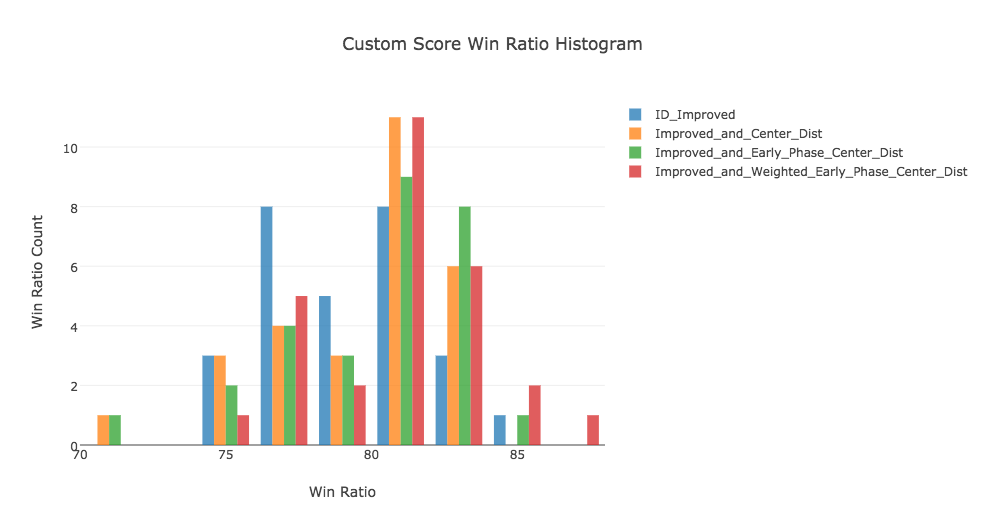

## Heuristic Evaluation Function Analysis

Three different evaluation functions are implemented, and each one is based on the previous one. The first one is based on the _improved\_score_, with an extra penalty. The penalty term is the euclidean distance between the players current position and the board center. Reason for adding this penalty is to try to keep the player's position prone to stay in the mid area, because a player in margin area are more likely to be stuck and lose the game. The first evaluation function is called _Center\_Dist\_ID\_Improved_.

Experiment is held by running 5 matches (20 games) against each opponent (_Random_, _MM\_Null_, _MM\_Open_, _MM\_Improved_, _AB\_Null_, _AB\_Open_, and _AB\_Improved_). The related win ratio is recorded. 28 experiments are run for _ID\_Improved_ and the three  evaluation functions implemented. T-test is used to evaluate the performance between each one and _ID\_Improved_. _Center\_Dist\_ID\_Improved_ is slightly better than _ID\_Improved_, as shown in Table.1 but not significant at all.

The second evaluation function, is called _Early\_Stage\_Center\_Dist\_ID\_Improved_, which is based on _Center\_Dist\_ID\_Improved_, but the penalty only work in the early phase of the game, when the blank space is still more than 31. At later phase of the game, the tree search can go more deeper and the penalty term may not be so necessary. _Early\_Stage\_Center\_Dist\_ID\_Improved_ performs better than _Center\_Dist\_ID\_Improved_, as shown in Table.1. But its win ratio distribution is still not significantly better than _ID\_Improved_, according to the t-test result shown in Table.1.

The third evaluation function is called _Early\_Stage\_Weighted\_Center\_Dist\_ID\_Improved_. It is based on _Early\_Stage\_Center\_Dist\_ID\_Improved_, but with its penalty term weighted by 1/2. Different weight can bring different combinational effect to the evaluation function, and this makes _Early\_Stage\_Weighted\_Center\_Dist\_ID\_Improved_ finally performs significantly better than _ID\_Improved_ according to the t-test result shown in Table.1. And of course, the finally introduced evalucation function, _Early\_Stage\_Weighted\_Center\_Dist\_ID\_Improved_ is recommended to play the game, according to the experimental data.

 

| Evaluation Function Name | t-statistic | p-value |
| ------| ------ | ------ |
| Center\_Dist\_ID\_Improved | 0.245 | 0.807 |
| Early\_Stage\_Center\_Dist\_ID\_Improved | 0.955 | 0.344 |
| Early\_Stage\_Weighted\_Center\_Dist\_ID\_Improved | 2.023 | 0.047 |
Table 1. Win ratio t-test with ID_Improved.

 

*Custom Score Win Ratio Histogram*

